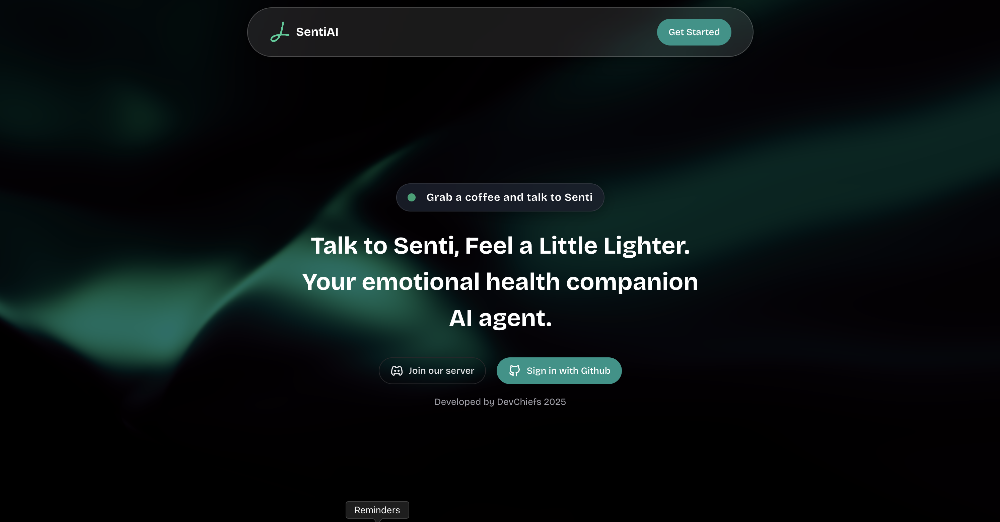

# 🧠 SentiAI - Your Emotional Health Companion



**Talk to Senti, Feel a Little Lighter.** SentiAI is an AI-powered emotional health companion designed to provide supportive conversations, mindfulness guidance, and mental wellness tools.

## ✨ Features

- 🤖 **AI-Powered Conversations**: Chat with Senti, a warm and empathetic AI companion
- 🎯 **Mental Health Support**: Mood check-ins, mindfulness exercises, and self-care guidance
- 🔊 **Text-to-Speech**: Listen to AI responses with built-in speech synthesis
- 💬 **Session Management**: Create and manage multiple chat sessions
- 🌙 **Modern UI**: Beautiful, responsive interface with glassmorphism design
- 🔐 **GitHub Authentication**: Secure login with GitHub OAuth
- 🎮 **Discord Integration**: Join our supportive community
- 📱 **Mobile Responsive**: Works seamlessly on all devices

## 🛠️ Tech Stack

### Frontend (Next.js App)
- **Framework**: Next.js 15 with React 19
- **UI Library**: Chakra UI v3 with custom theming
- **Styling**: Tailwind CSS v4
- **Animations**: Framer Motion & GSAP
- **State Management**: Zustand
- **GraphQL Client**: Apollo Client
- **Icons**: React Icons
- **Markdown**: React Markdown with remark-gfm

### Backend (NestJS GraphQL API)
- **Framework**: NestJS with GraphQL
- **Database**: MongoDB with Mongoose
- **AI Integration**: OpenAI GPT-4.1
- **Authentication**: JWT with GitHub OAuth
- **API**: Apollo Server
- **Validation**: Zod schemas

## 🚀 Getting Started

### Prerequisites
- Node.js 18+ and npm
- MongoDB database
- OpenAI API key
- GitHub OAuth App credentials

### Installation

1. **Clone the repository**
   ```bash
   git clone https://github.com/your-username/senti-ai.git
   cd senti-ai
   ```

2. **Install frontend dependencies**
   ```bash
   cd senti-app
   npm install
   ```

3. **Install backend dependencies**
   ```bash
   cd ../senti-graphql
   npm install
   ```

4. **Environment Setup**
   
   Create `.env` file in `senti-graphql/`:
   ```env
   MONGODB_URI=your_mongodb_connection_string
   OPENAI_API_KEY=your_openai_api_key
   JWT_SECRET=your_jwt_secret
   GITHUB_CLIENT_ID=your_github_client_id
   GITHUB_CLIENT_SECRET=your_github_client_secret
   ```

5. **Start the development servers**
   
   Backend (GraphQL API):
   ```bash
   cd senti-graphql
   npm run start:dev
   ```
   
   Frontend (Next.js):
   ```bash
   cd senti-app
   npm run dev
   ```

6. **Access the application**
   - Frontend: http://localhost:3000
   - GraphQL Playground: http://localhost:4000/graphql

## 🎯 Core Features

### Mental Health Support
- **Mood Check-ins**: Regular emotional state assessments
- **Mindfulness Tools**: Breathing exercises, grounding techniques, body scan meditations
- **Journal Prompts**: Guided reflection and emotional processing
- **Daily Affirmations**: Positive reinforcement and self-care reminders
- **Crisis Detection**: Automatic detection and appropriate resource provision

### AI Conversation
- Powered by OpenAI GPT-4.1 with specialized mental health instructions
- Warm, empathetic, and non-judgmental responses
- Context-aware conversations across sessions
- Safety protocols for crisis situations

### User Experience
- **Session Management**: Create, manage, and revisit conversations
- **Text-to-Speech**: Accessibility feature for audio consumption
- **Responsive Design**: Optimized for desktop, tablet, and mobile
- **Dark Theme**: Eye-friendly interface with glassmorphism effects

## 📁 Project Structure

```
senti-ai/
├── senti-app/                 # Next.js Frontend
│   ├── src/
│   │   ├── app/               # App Router pages
│   │   ├── components/        # Reusable UI components
│   │   └── gql/              # Generated GraphQL types
│   ├── public/               # Static assets
│   └── package.json
├── senti-graphql/            # NestJS Backend
│   ├── src/
│   │   ├── messages/         # Message handling & AI integration
│   │   ├── sessions/         # Chat session management
│   │   ├── users/           # User authentication & management
│   │   └── main.ts          # Application entry point
│   └── package.json
└── README.md
```

## 🔧 Available Scripts

### Frontend (senti-app)
```bash
npm run dev          # Start development server
npm run build        # Build for production
npm run start        # Start production server
npm run lint         # Run ESLint
npm run codegen      # Generate GraphQL types
```

### Backend (senti-graphql)
```bash
npm run start:dev    # Start development server with watch
npm run build        # Build for production
npm run start:prod   # Start production server
npm run test         # Run tests
npm run lint         # Run ESLint
```

## 🤝 Contributing

We welcome contributions! Please feel free to submit a Pull Request. For major changes, please open an issue first to discuss what you would like to change.

1. Fork the repository
2. Create your feature branch (`git checkout -b feature/AmazingFeature`)
3. Commit your changes (`git commit -m 'Add some AmazingFeature'`)
4. Push to the branch (`git push origin feature/AmazingFeature`)
5. Open a Pull Request

## 🛡️ Safety & Privacy

- **Crisis Protocol**: Automatic detection of crisis situations with appropriate resource provision
- **Data Privacy**: User conversations are handled with strict privacy measures
- **No Medical Advice**: Senti provides emotional support but is not a replacement for professional therapy
- **Secure Authentication**: GitHub OAuth integration for secure user management

## 📞 Support & Community

- **Discord Server**: [Join our community](https://discord.gg/ZXcnWz55zg)
- **Issues**: Report bugs or request features via GitHub Issues
- **Documentation**: Comprehensive guides in the `/docs` folder

## 📄 License

This project is licensed under the MIT License - see the [LICENSE](LICENSE) file for details.

## 👥 Team

Developed with ❤️ by **DevChiefs** - 2025

---

**Disclaimer**: SentiAI is designed to provide emotional support and is not a substitute for professional mental health treatment. If you're experiencing a mental health crisis, please contact your local emergency services or a mental health professional.

**Crisis Resources**:
- Philippines: National Mental Health Crisis Hotline - 1553 (toll-free) or 0966-351-4518
- International: Contact your local emergency services or visit [findahelpline.com](https://findahelpline.com)